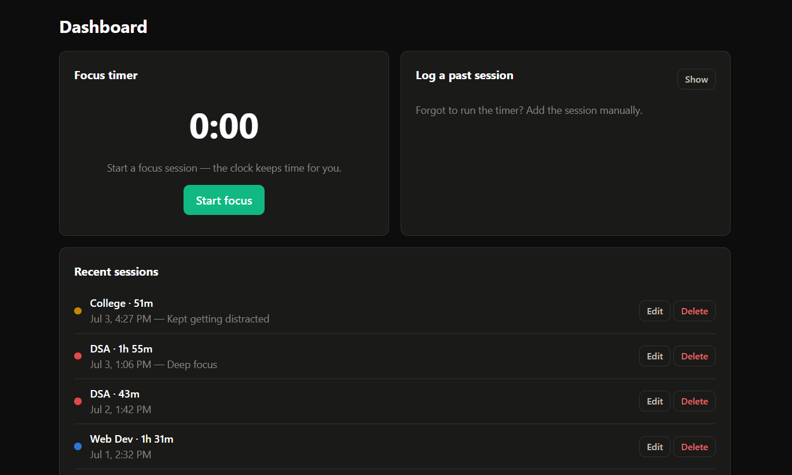
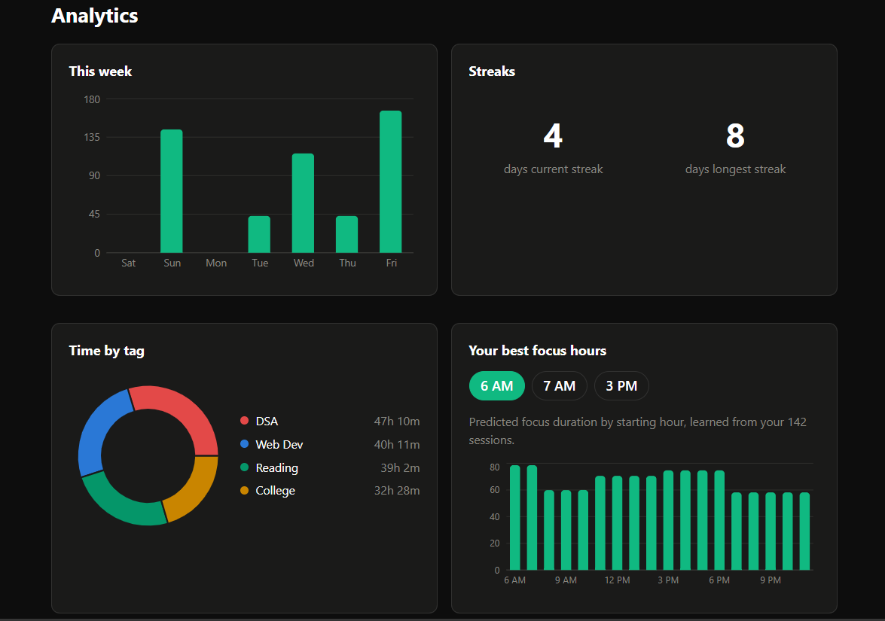
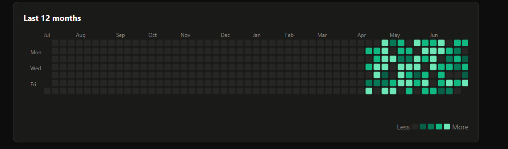

<div align="center">

# 🎯 Deep-Work Tracker

**Log timed focus sessions, tag them, and see where your attention actually goes** — weekly totals, a year-long contribution heatmap, focus streaks, and an ML model that learns *your* most productive hours.


🔗 **[Live Demo](https://deep-hour-nu.vercel.app/)** &nbsp;·&nbsp; 🧑‍💻 Try it with the demo account → `demo@demo.com` / `demo1234`

</div>

---

## 📸 Screenshots

| Dashboard — live timer + recent sessions | Analytics — weekly chart, tag donut, streaks |
|:---:|:---:|
|  |  |
| **Year heatmap** — GitHub-style contribution grid 
|  

---

## 🏗️ Architecture

Three independent services + a managed Postgres. The browser only ever talks to the API; the API is the only thing that talks to the ML service.

```
┌──────────────────┐   HTTPS   ┌───────────────────┐    SQL     ┌──────────────────┐
│   React (Vite)   │   /api    │   Express API     │  (pg pool) │   PostgreSQL     │
│                  ├──────────►│                   ├───────────►│   (Supabase)     │
│  axios · JWT     │  axios    │  auth · tags      │  parameter-│                  │
│  Recharts        │           │  sessions         │  ized SQL  │  users · tags    │
│  calendar-heatmap│           │  analytics        │            │  sessions        │
└──────────────────┘           │  insights ───┐    │            └──────────────────┘
                               └──────────────┼────┘
                                     POST /predict │  (X-ML-Secret)
                                                   ▼
                                        ┌──────────────────────┐
                                        │   Flask ML service   │
                                        │  DecisionTreeRegressor│
                                        │  trained per-request  │
                                        └──────────────────────┘
```

**Why a separate ML service?** Three reasons I can defend in an interview: **language fit** (scikit-learn is the right tool, and it's Python), **failure isolation** (the predictor is optional — if Flask is down, `/insights` returns `{ available: false }` instead of taking session logging down with it), and **independent evolution** (retrain or scale the model without redeploying the core API).

---

## 💡 Engineering highlights

The parts I'd walk an interviewer through:

- **🔒 Multi-tenant security by construction.** Every data query is scoped `WHERE user_id = $n` from the JWT — there is no code path that returns another user's row. Cross-user reads/writes return `404`, never a leak. Proven by 5 dedicated isolation tests in the smoke suite.
- **🧠 Streak detection in pure SQL.** Current/longest streaks use the *islands-and-gaps* window-function trick (`date − ROW_NUMBER()` groups consecutive days). No app-side date looping — the database does it in one query. ([analytics.js](server/src/routes/analytics.js) has a step-by-step comment block.)
- **📊 Gap-free time series.** Weekly totals use `generate_series` + `LEFT JOIN` so days with zero sessions still appear — including the subtle reason `user_id` must live in the `JOIN` condition, not the `WHERE` (or the outer join silently collapses to an inner one).
- **🌐 Graceful degradation across a service boundary.** The API calls Flask with a 5s timeout and a shared-secret header; *any* failure (down, slow, error) maps to a calm `{ available: false, reason }` — the UI shows a friendly message, nothing crashes.
- **🕐 Timezone-correct by design.** Sessions store naive local wall-clock time, and a custom `pg` type parser stops Postgres from silently shifting `DATE`/`TIMESTAMP` values to UTC — so "9 AM" stays 9 AM in the analytics and the ML features.
- **♿ Accessibility-validated charts.** The categorical palette is colorblind-safe (validated for both light **and** dark surfaces with a ΔE script), single-hue sequential ramps for the heatmap, and identity never conveyed by color alone.
- **✅ One-command end-to-end test.** [`smoke-test.mjs`](smoke-test.mjs) runs **35 checks** across auth, CRUD, filters, security isolation, analytics, and the ML path — the safety net behind every change.

**Also:** raw parameterized SQL (no ORM, no injection surface), bcrypt password hashing, consistent `{ error }` responses with meaningful status codes, and loading/error/empty states on every screen.

---

## 🧩 Tech stack

| Layer | Choice | Notes |
|---|---|---|
| **Frontend** | React 18 + Vite, React Router, axios | Recharts (bar/donut), react-calendar-heatmap, plain CSS with light/dark tokens |
| **API** | Node + Express | JWT auth (jsonwebtoken + bcrypt), `pg` connection pool |
| **Database** | PostgreSQL | Raw parameterized SQL, no ORM · hosted on Supabase |
| **ML service** | Python + Flask | scikit-learn `DecisionTreeRegressor`, trained per request |

---

## 🚀 Quick start

**Prerequisites:** Node 18+, Python 3.10+, and a Postgres database (a free [Supabase](https://supabase.com) project works out of the box).

**1. Database** — run [`server/db/schema.sql`](server/db/schema.sql) against your DB (paste into the Supabase **SQL Editor** → Run). It creates the tables **and** seeds a demo account with ~90 days of realistic data. Re-running is safe.

> 🔑 Demo login: **`demo@demo.com`** / **`demo1234`**

<details>
<summary><b>2. Run all three services</b> (click to expand)</summary>

```bash
# API  → http://localhost:4000
cd server
npm install
cp .env.example .env         # add DATABASE_URL + JWT_SECRET
npm start

# ML service  → http://localhost:5001
cd ml-service
python -m venv .venv
.venv\Scripts\pip install -r requirements.txt      # Windows
# .venv/bin/pip install -r requirements.txt        # macOS/Linux
.venv\Scripts\python app.py

# Client  → http://localhost:5173
cd client
npm install
npm run dev
```

**Windows shortcut:** `.\dev.ps1` from the repo root launches all three in separate windows.

**Verify:** with the API + ML service up, `node smoke-test.mjs` runs 35 end-to-end checks.

</details>

---

## 📡 API reference

All routes are prefixed `/api`. 🔒 = requires `Authorization: Bearer <JWT>`.

| Method | Endpoint | Description |
|---|---|---|
| `POST` | `/auth/signup` | Create account → `{ token, user }` · `400` invalid, `409` duplicate email |
| `POST` | `/auth/login` | Log in → `{ token, user }` · `401` bad credentials |
| `GET` 🔒 | `/tags` | List your tags |
| `POST` 🔒 | `/tags` | Create `{ name, color? }` · `409` duplicate name |
| `PUT` 🔒 | `/tags/:id` | Update name and/or color |
| `DELETE` 🔒 | `/tags/:id` | Delete — sessions survive with `tag_id = NULL` |
| `GET` 🔒 | `/sessions` | List; optional `?from=&to=&tag_id=` filters |
| `POST` 🔒 | `/sessions` | Log `{ started_at, duration_minutes, tag_id?, note? }` · rejects 0/negative & future times |
| `PUT` 🔒 | `/sessions/:id` | Partial update (any field; `tag_id`/`note` nullable) |
| `DELETE` 🔒 | `/sessions/:id` | Delete session |
| `GET` 🔒 | `/analytics/weekly` | Minutes/day, last 7 days, zero days included |
| `GET` 🔒 | `/analytics/tags` | Minutes per tag, with name + color |
| `GET` 🔒 | `/analytics/heatmap` | `{ date, minutes }` per active day, last 365 |
| `GET` 🔒 | `/analytics/streaks` | `{ current_streak, longest_streak }` |
| `GET` 🔒 | `/insights/best-hours` | ML prediction; `{ available: false }` if <10 sessions or ML down |

---

## ☁️ Deployment

Deploys cleanly to **Supabase** (DB) + **Render** ×2 (API & ML) + **Vercel** (client). Deploy order matters — each service's URL feeds the next.

| Service | Host | Start command | Key env vars |
|---|---|---|---|
| ML | Render | `gunicorn -b 0.0.0.0:$PORT app:app` | `ML_SHARED_SECRET` |
| API | Render | `npm start` | `DATABASE_URL`, `JWT_SECRET`, `ML_SERVICE_URL`, `ML_SHARED_SECRET`, `CORS_ORIGIN` |
| Client | Vercel | `npm run build` (Vite preset) | `VITE_API_URL` = API origin + `/api` |

Generate secrets: `node -e "console.log(require('crypto').randomBytes(48).toString('hex'))"`

> **Notes:** the ML service is protected by a shared-secret header (`X-ML-Secret`), so only the API can reach `/predict`. Render's free tier sleeps after 15 min idle — expect a ~30s cold start on the first request. Set `CORS_ORIGIN` to the exact Vercel origin (no trailing slash).

---

## ⚠️ Known limitations & next steps

Honest scope boundaries (and what I'd build next):

- **No token refresh / revocation** — JWTs expire after 7 days; add refresh tokens for a real deployment.
- **Timer is in-memory** — a mid-session page reload loses the running clock; would persist to `localStorage`.
- **No rate limiting** — add `express-rate-limit` on `/auth` before public exposure.
- **Simple ML by design** — one decision tree per request; adjacent hours share predictions. A larger dataset would justify a richer model and a stored/versioned artifact.
- **No pagination** — `/sessions` returns all rows (fine for personal scale, unbounded in theory).

---

<div align="center">
<sub>Built as a full-stack portfolio project — React · Express · PostgreSQL · Flask · scikit-learn</sub>
</div>
